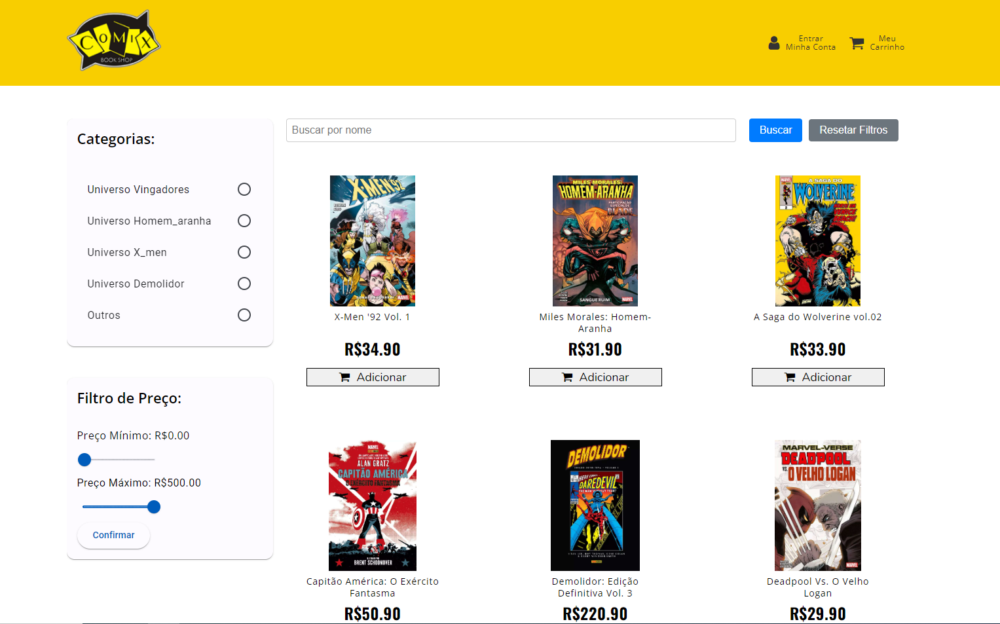
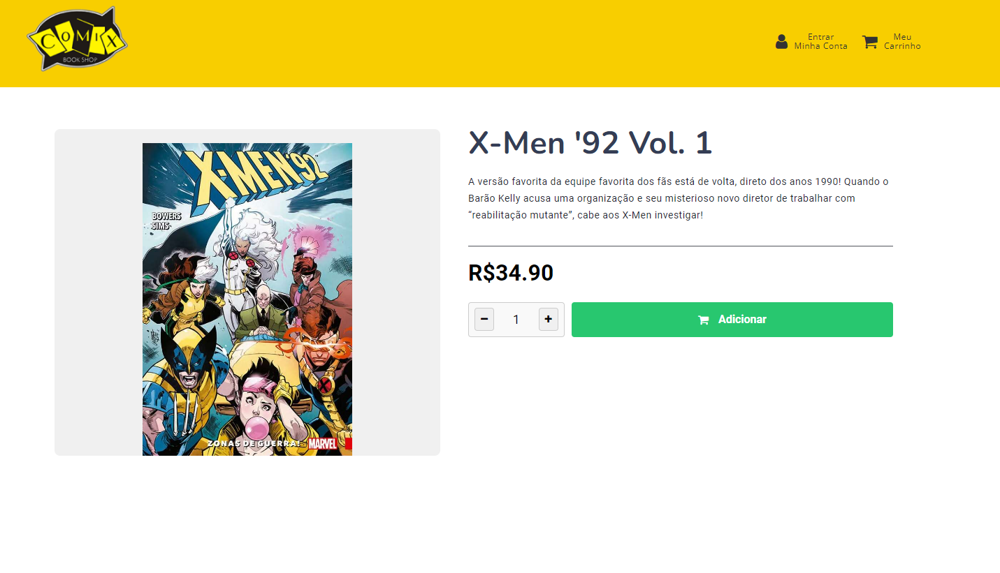
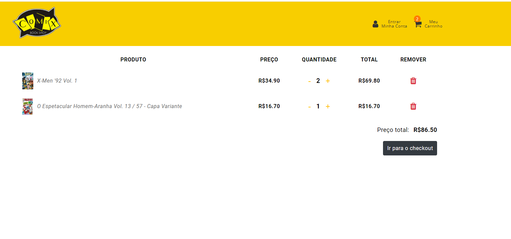

# HQ Shop App

## Api feita para consumo
[Está neste repósitorio!](https://github.com/eduardo-araujo1/marvelHQ)

## Versão Angular
+ **18.1.3**

## Fluxo

+ [✔] Cadastro do Usuário
+ [✔] Autenticação do Usuário
+ [✔] Busca por nome do produto 
+ [✔] Filtro de preço
+ [✔] Filtro por categoria
+ [✔] Carrinho de Compra
+ [✔] Finalizar Compra 

# Algumas fotos

## Produtos

## Detalhe do produto

## Carrinho

## Como rodar o projeto
 1. **Instalar as dependências:**  
   Após clonar o repositório, navegue até a pasta do projeto e rode o comando: `npm install`

2. **Rodar a aplicação:**
 Digite `ng serve` e acesse a página `http://localhost:4200/`